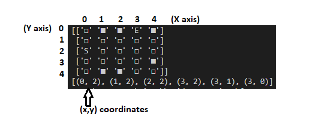
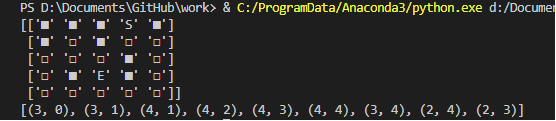

# Grid_Game_using_Bfs

Ques[2]. Python
Print the result of using python

Think about you have a 5x5 square space.

ex)

□□□□□

□□□□□

□□□□□

□□□□□

□□□□□

Only four random obstacles are generated here.

ex)

□□□□□

□■□□□

□□□■□

□□□□□

□■□□■

S = Start Point

E = End Point

The exit and entrance are assumed to be S / E respectively.

Exits and entrances must be created at the end of the space

1. Print out a randomly generated string (the result should be different for each execution)
2. Print the x_y coordinates that reach the shortest distance from S to E (there may be 2 answers)

### Output no. 1 (with little explaination)

### Output no. 2

